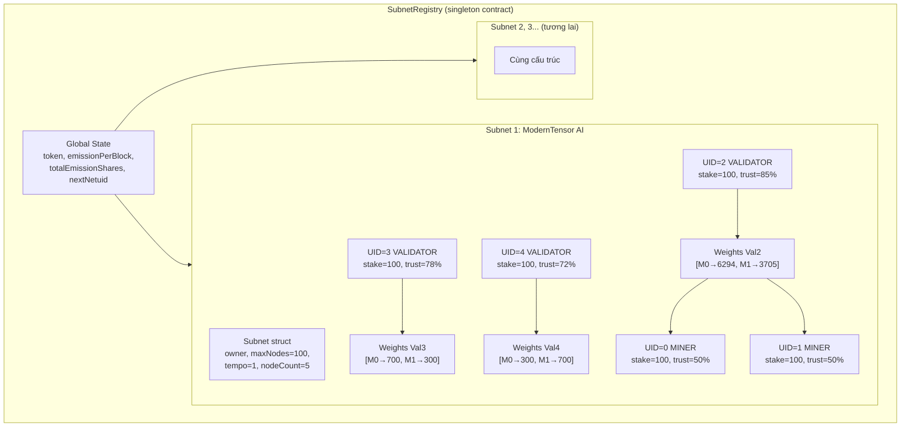
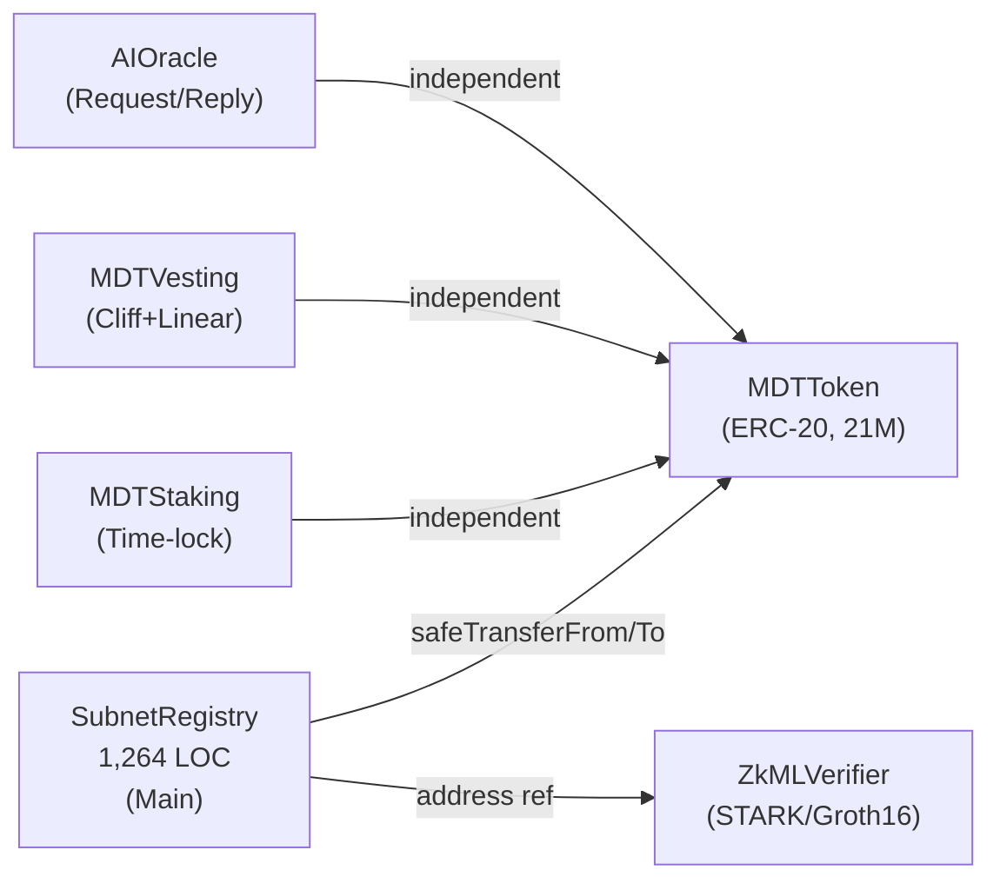

# ModernTensor — Báo Cáo Cấu Trúc Hệ Thống On-Chain

**Phân tích chi tiết từ mã nguồn [SubnetRegistry.sol](file:///media/son/Projects1/venera/polkadot/hackathon/moderntensor_polkadot/luxtensor/contracts/src/SubnetRegistry.sol) (1,264 dòng Solidity)**

---

## 1. Tổng quan kiến trúc

### Câu trả lời nhanh

| Câu hỏi | Trả lời |
|---------|---------|
| Subnet có được neo trên smart contract không? | **CÓ** — mỗi subnet là 1 struct [Subnet](file:///media/son/Projects1/venera/polkadot/hackathon/moderntensor_polkadot/sdk/polkadot/subnet.py#37-53) lưu trực tiếp trong [SubnetRegistry.sol](file:///media/son/Projects1/venera/polkadot/hackathon/moderntensor_polkadot/luxtensor/contracts/src/SubnetRegistry.sol) |
| Mỗi subnet quản lý miners/validators riêng không? | **CÓ** — mọi dữ liệu đều key theo [netuid](file:///media/son/Projects1/venera/polkadot/hackathon/moderntensor_polkadot/sdk/polkadot/subnet.py#213-216) (ID subnet) |
| Có bao nhiêu contract? | **1 contract `SubnetRegistry`** quản lý TẤT CẢ subnets (singleton pattern) |
| Miners/validators lưu ở đâu? | Mapping `nodes[netuid][uid]` — mỗi subnet có bảng node riêng |
| Weights quản lý thế nào? | Mỗi validator có 1 array weights riêng, scoped theo subnet |

### Sơ đồ kiến trúc



---

## 2. Data Structures — Chi tiết từng trường

### 2.1 [Subnet](file:///media/son/Projects1/venera/polkadot/hackathon/moderntensor_polkadot/sdk/polkadot/subnet.py#37-53) struct (12 trường)

[Từ SubnetRegistry.sol, dòng 39-52](file:///media/son/Projects1/venera/polkadot/hackathon/moderntensor_polkadot/luxtensor/contracts/src/SubnetRegistry.sol#L39-L52)

```solidity
struct Subnet {
    string   name;             // Tên subnet (max 64 chars)
    address  owner;            // Địa chỉ người tạo subnet
    uint256  maxNodes;         // Số node tối đa (1-4096)
    uint256  emissionShare;    // Phần emission (basis points, default 1000 = 10%)
    uint256  tempo;            // Số block mỗi epoch
    uint256  lastEpochBlock;   // Block cuối cùng chạy epoch
    uint256  minStake;         // Stake tối thiểu để đăng ký (wei)
    uint256  immunityPeriod;   // Số block trước khi cho phép deregister (default 7200)
    uint256  nodeCount;        // Số node active hiện tại
    uint256  nextUid;          // Counter UID tăng dần (không bao giờ giảm)
    bool     active;           // Subnet còn hoạt động không
    uint256  createdAt;        // Timestamp tạo subnet
}
```

| Trường | Kiểu | Mô tả | Ví dụ thực tế |
|--------|------|-------|---------------|
| `name` | string | Tên hiển thị | "ModernTensor AI" |
| `owner` | address | Người sở hữu, có quyền update | `0x54C3...eB9` |
| `maxNodes` | uint256 | Giới hạn miner+validator | 100 |
| `emissionShare` | uint256 | % emission global (BPS) | 1000 (= 10%) |
| `tempo` | uint256 | Epoch = bao nhiêu block | 1 (demo), 360 (prod) |
| `lastEpochBlock` | uint256 | Block chạy epoch gần nhất | 6138049 |
| `minStake` | uint256 | Stake tối thiểu (wei) | 0 hoặc 100×10¹⁸ |
| `immunityPeriod` | uint256 | Bảo vệ node mới | 7200 blocks (~24h) |
| `nodeCount` | uint256 | Tổng node đang active | 5 |
| `nextUid` | uint256 | UID kế tiếp sẽ gán | 5 (đã gán 0-4) |
| [active](file:///media/son/Projects1/venera/polkadot/hackathon/moderntensor_polkadot/sdk/polkadot/subnet.py#451-467) | bool | Subnet hoạt động? | true |
| `createdAt` | uint256 | Unix timestamp | 1741... |

### 2.2 [Node](file:///media/son/Projects1/venera/polkadot/hackathon/moderntensor_polkadot/sdk/polkadot/subnet.py#55-95) struct (12 trường)

[Từ SubnetRegistry.sol, dòng 54-67](file:///media/son/Projects1/venera/polkadot/hackathon/moderntensor_polkadot/luxtensor/contracts/src/SubnetRegistry.sol#L54-L67)

```solidity
struct Node {
    address  hotkey;           // Public key mạng (network identity)
    address  coldkey;          // Wallet key (người sở hữu)
    NodeType nodeType;         // MINER (0) hoặc VALIDATOR (1)
    uint256  stake;            // Stake trực tiếp (wei)
    uint256  delegatedStake;   // Stake được ủy quyền (wei)
    uint256  lastUpdate;       // Block hoạt động gần nhất
    uint16   uid;              // ID duy nhất trong subnet
    bool     active;           // Còn hoạt động không
    uint256  incentive;        // Tổng incentive tích lũy (scaled 1e18)
    uint256  trust;            // Trust score (0 → 1e18, khởi tạo 50%)
    uint256  rank;             // Rank từ epoch gần nhất (0 → 1e18)
    uint256  emission;         // Phần thưởng pending, chưa claim (wei)
}
```

| Trường | Kiểu | Mô tả | Ví dụ |
|--------|------|-------|-------|
| `hotkey` | address | Key định danh mạng | `0x526C...4B9` |
| `coldkey` | address | Ví người sở hữu | `0xA046...52F` |
| `nodeType` | enum(0,1) | MINER=0, VALIDATOR=1 | 0 |
| [stake](file:///media/son/Projects1/venera/polkadot/hackathon/moderntensor_polkadot/sdk/polkadot/subnet.py#112-115) | uint256 | Stake trực tiếp (wei) | 100×10¹⁸ |
| `delegatedStake` | uint256 | Stake từ delegator | 0 |
| `lastUpdate` | uint256 | Block set weights gần nhất | 6138033 |
| [uid](file:///media/son/Projects1/venera/polkadot/hackathon/moderntensor_polkadot/sdk/polkadot/subnet.py#285-289) | uint16 | ID trong subnet (0,1,2...) | 0 |
| [active](file:///media/son/Projects1/venera/polkadot/hackathon/moderntensor_polkadot/sdk/polkadot/subnet.py#451-467) | bool | Đang hoạt động? | true |
| `incentive` | uint256 | Tổng emission đã nhận | 42.49×10¹⁸ |
| [trust](file:///media/son/Projects1/venera/polkadot/hackathon/moderntensor_polkadot/sdk/polkadot/subnet.py#533-545) | uint256 | Trust score (0→1e18) | 0.85×10¹⁸ (85%) |
| [rank](file:///media/son/Projects1/venera/polkadot/hackathon/moderntensor_polkadot/sdk/polkadot/subnet.py#79-82) | uint256 | Rank miner (0→1e18) | 0.545×10¹⁸ |
| [emission](file:///media/son/Projects1/venera/polkadot/hackathon/moderntensor_polkadot/sdk/polkadot/subnet.py#416-420) | uint256 | Phần thưởng chờ claim | 40.14×10¹⁸ |

### 2.3 `WeightEntry` struct

```solidity
struct WeightEntry {
    uint16  uid;       // UID miner được chấm
    uint16  weight;    // Trọng số (0-65535)
}
```

### 2.4 `WeightCommit` struct (commit-reveal)

```solidity
struct WeightCommit {
    bytes32  commitHash;   // keccak256(abi.encodePacked(uids, weights, salt))
    uint256  commitBlock;  // Block lúc commit
    bool     revealed;     // Đã reveal chưa
}
```

---

## 3. State Mappings — 8 Mappings on-chain

[Từ SubnetRegistry.sol, dòng 82-131](file:///media/son/Projects1/venera/polkadot/hackathon/moderntensor_polkadot/luxtensor/contracts/src/SubnetRegistry.sol#L82-L131)

```solidity
// 1. Subnet data — KEY: netuid
mapping(uint256 => Subnet) public subnets;

// 2. Node data — KEY: (netuid, uid)
mapping(uint256 => mapping(uint16 => Node)) public nodes;

// 3. Weights — KEY: (netuid, validatorUid) → WeightEntry[]
mapping(uint256 => mapping(uint16 => WeightEntry[])) internal _weights;

// 4. Registration check — KEY: (netuid, hotkey) → bool
mapping(uint256 => mapping(address => bool)) public isRegistered;

// 5. Hotkey to UID lookup — KEY: (netuid, hotkey) → uid
mapping(uint256 => mapping(address => uint16)) public hotkeyToUid;

// 6. Delegations — KEY: (delegator, keccak(netuid,valUid)) → amount
mapping(address => mapping(bytes32 => uint256)) public delegations;

// 7. Weight commits — KEY: (netuid, validatorUid) → WeightCommit
mapping(uint256 => mapping(uint16 => WeightCommit)) public weightCommits;

// 8. Self-vote protection — KEY: (netuid, coldkey, NodeType) → bool
mapping(uint256 => mapping(address => mapping(NodeType => bool))) public coldkeyNodeType;
```

### Sơ đồ quan hệ dữ liệu

```
 netuid ─────┬──► subnets[netuid]                    → Subnet {12 fields}
             ├──► nodes[netuid][uid]                  → Node {12 fields}
             ├──► _weights[netuid][valUid]            → WeightEntry[] {uid, weight}
             ├──► isRegistered[netuid][hotkey]         → bool
             ├──► hotkeyToUid[netuid][hotkey]          → uint16 uid
             ├──► weightCommits[netuid][valUid]        → WeightCommit {hash, block}
             └──► coldkeyNodeType[netuid][coldkey][t]  → bool

 delegator ──────► delegations[delegator][key]         → uint256 amount
                   (key = keccak256(netuid, valUid))
```

> **Kết luận:** Mọi dữ liệu đều phân tách theo [netuid](file:///media/son/Projects1/venera/polkadot/hackathon/moderntensor_polkadot/sdk/polkadot/subnet.py#213-216). Mỗi subnet **hoàn toàn độc lập** — miners, validators, weights, emissions, trust scores đều riêng biệt.

---

## 4. Quy trình hoạt động

### 4.1 Tạo Subnet

```
createSubnet("AI Medical", 256, 100e18, 360)
  ├─ Validate: name 1-64 chars, maxNodes 1-4096, tempo > 0
  ├─ Thu phí: subnetRegistrationCost MDT → contract
  ├─ netuid = nextNetuid++ (tăng dần)
  ├─ Khởi tạo: emissionShare=1000, immunityPeriod=7200, nodeCount=0
  ├─ totalEmissionShares += 1000
  └─ Emit: SubnetCreated(netuid, name, owner)
```

### 4.2 Đăng ký Node

```
registerNode(netuid=1, hotkey, MINER, 100e18)
  ├─ Check: subnet active, hotkey unique, nodeCount < max, stake >= min
  ├─ [SECURITY] Self-vote: coldkey chưa đăng ký loại ĐỐI LẬP
  ├─ Transfer stake MDT → contract
  ├─ UID = nextUid++ (không tái sử dụng)
  ├─ Tạo Node: trust=50%, emission=0, rank=0
  ├─ Update lookups: hotkeyToUid, isRegistered, coldkeyNodeType
  └─ Emit: NodeRegistered(netuid, uid, hotkey, coldkey, MINER)
```

### 4.3 Set Weights

**Cách 1: Commit-Reveal** (production, anti-frontrunning)
```
Phase 1: commitWeights(netuid, hash)     → lưu hash, chờ 10 blocks
Phase 2: revealWeights(netuid, uids, weights, salt)
  ├─ Verify: hash match, within window (600 blocks)
  ├─ Validate: targets phải là MINER active
  └─ Store: _weights[netuid][valUid] = entries
```

**Cách 2: setWeights** (owner-only, emergency/demo)

### 4.4 Run Epoch — Enhanced Yuma Consensus

[Từ SubnetRegistry.sol, dòng 643-683](file:///media/son/Projects1/venera/polkadot/hackathon/moderntensor_polkadot/luxtensor/contracts/src/SubnetRegistry.sol#L643-L683)

```
runEpoch(netuid=1)   [ai cũng gọi được, nếu đủ blocks]
  │
  ├─ totalEmission = emissionPerBlock × blocksPassed × emissionShare/totalShares
  │  Cap: min(totalEmission, contractBalance)  [SOLVENCY]
  │
  ├─ STEP 1: Compute Scores (Quadratic + Trust)
  │   Mỗi Validator:
  │     votingPower = sqrt(stake + delegatedStake)           ← QUADRATIC
  │     trustMult   = 1.0 + trust × 0.5                     ← range [1.0, 1.5]
  │     effectPower = votingPower × trustMult
  │     Mỗi WeightEntry:
  │       scores[minerUid] += effectPower × weight / sum
  │
  ├─ STEP 2: Miner Emission (82%)
  │   emission = minerShare × score / totalScore
  │   rank    = score / totalScore
  │
  ├─ STEP 3: Validator Emission (18%)
  │   effectStake = (stake + delegated) × trustMult
  │   emission = valShare × effectStake / totalEffective
  │
  ├─ STEP 4: Update Trust Scores (EMA)
  │   Có weights:    trust = old×70% + alignment×30%
  │   Không weights: trust = old×95% (decay -5%)
  │
  └─ lastEpochBlock = block.number
```

---

## 5. Cơ chế bảo mật — 6 lớp

| # | Cơ chế | Code location | Mô tả |
|---|--------|--------------|-------|
| 1 | **Self-Vote Protection** | L383-392 | Cùng coldkey không thể vừa MINER vừa VALIDATOR |
| 2 | **Quadratic Voting** | L701 | `votingPower = sqrt(stake)` — giảm whale dominance |
| 3 | **Trust Score (EMA)** | L801-827 | 70/30 EMA — validator sai giảm ảnh hưởng dần |
| 4 | **Commit-Reveal** | L480-563 | 2-phase weight setting, anti-frontrunning |
| 5 | **Slashing** | L884-945 | Phạt 1-50% stake, auto-slash inactive |
| 6 | **Solvency Check** | L656-659 | Cap emission ≤ contract balance |

---

## 6. Quan hệ giữa các Contract



> `SubnetRegistry` là **contract trung tâm** — quản lý toàn bộ subnets, nodes, weights, emission, trust. Các contract khác hoạt động **độc lập**.

---

## 7. Admin Functions

| Function | Quyền | Mô tả |
|----------|-------|-------|
| `createSubnet()` | Bất kỳ ai | Tạo subnet (trả phí) |
| `registerNode()` | Bất kỳ ai | Đăng ký miner/validator (stake) |
| `commitWeights()` | Validator | Commit hash weights |
| `revealWeights()` | Validator | Reveal weights |
| `runEpoch()` | Bất kỳ ai | Trigger epoch |
| `claimEmission()` | Node owner | Rút phần thưởng |
| [delegate()/undelegate()](file:///media/son/Projects1/venera/polkadot/hackathon/moderntensor_polkadot/sdk/polkadot/subnet.py#472-489) | Bất kỳ ai | Ủy quyền stake |
| `autoSlashInactive()` | Bất kỳ ai | Phạt validator lười |
| `setWeights()` | **Owner** | Set weights khẩn cấp |
| `slashNode()` | **Owner/Subnet owner** | Phạt gian lận |
| `updateSubnet()` | **Owner/Subnet owner** | Cập nhật params |
| `setEmissionPerBlock()` | **Owner** | Thay đổi emission |
| `fundEmissionPool()` | **Owner** | Nạp MDT vào pool |

### Governance Roadmap

| Phase | Mô tả | Trạng thái |
|-------|-------|-----------|
| 1 | Owner-managed (onlyOwner) | ✅ Hiện tại |
| 2 | DAO Governance (validator proposals, >50% vote) | 📅 Planned |
| 3 | Polkadot OpenGov (XCM cross-chain governance) | 🎯 Future |

---

## 8. Dữ liệu On-Chain thực tế

### Subnet 1

| Trường | Giá trị |
|--------|---------|
| name | "ModernTensor AI" |
| owner | `0x54C375b935344fC3c16E5e83F444DB54dE0E6eB9` |
| maxNodes | 100 |
| emissionShare | 1000 (10%) |
| tempo | 1 block |
| nodeCount | 5 |

### Nodes

| UID | Type | Hotkey | Stake | Trust | Rank | Emission |
|-----|------|--------|-------|-------|------|----------|
| 0 | MINER | `0x526C...` | 100 MDT | 50% | 0.545 | 0 (claimed) |
| 1 | MINER | `0x3B67...` | 100 MDT | 50% | 0.455 | 40.14 MDT |
| 2 | VALIDATOR | `0x29D1...` | 100 MDT | 85.12% | — | 0 (claimed) |
| 3 | VALIDATOR | `0xaFA8...` | 100 MDT | 77.66% | — | 6.04 MDT |
| 4 | VALIDATOR | `0x0eC0...` | 100 MDT | 72.25% | — | 6.05 MDT |

### Weights

| Validator | Target | Weights |
|-----------|--------|---------|
| UID=2 | [0, 1] | [6294, 3705] |
| UID=3 | [0, 1] | [700, 300] |
| UID=4 | [0, 1] | [300, 700] |

---

## 9. Kết luận

1. **CÓ — subnet neo hoàn toàn trên smart contract** (struct [Subnet](file:///media/son/Projects1/venera/polkadot/hackathon/moderntensor_polkadot/sdk/polkadot/subnet.py#37-53), 12 trường)
2. **CÓ — mỗi subnet quản lý miners/validators riêng** (tất cả mappings key theo [netuid](file:///media/son/Projects1/venera/polkadot/hackathon/moderntensor_polkadot/sdk/polkadot/subnet.py#213-216))
3. **Singleton pattern** — 1 contract quản lý TẤT CẢ subnets
4. **Emission phân tách** — mỗi subnet có `emissionShare` riêng, `runEpoch()` chạy độc lập
5. **Trust/Rank/Weights** — mỗi subnet có metagraph riêng, hoàn toàn tách biệt
